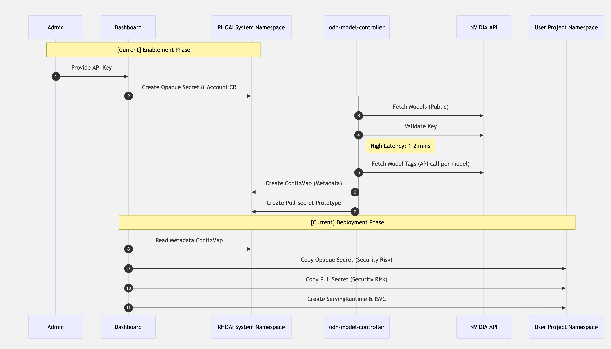
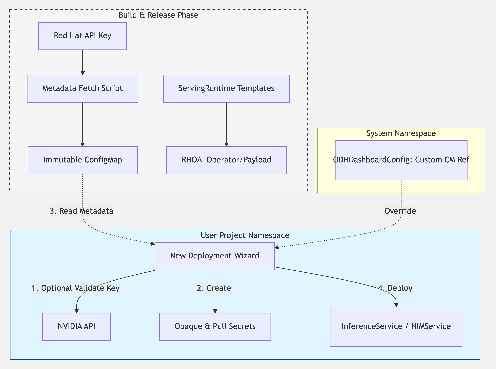

# ADR: Redesign of NVIDIA NIM Integration for RHOAI/ODH

Owner: [Tomer Figenblat](mailto:tfigenbl@redhat.com)  
Date: Jan 20, 2026  
Jira: [NVPE-390](https://issues.redhat.com/browse/NVPE-390)  
**Status**: Proposed

## Executive Summary

We are proposing a significant redesign of the NVIDIA NIM integration in OpenDataHub and Red Hat OpenShift AI. This redesign addresses critical user experience and security concerns while simplifying the codebase and enabling future enhancements.

**Key Outcomes:**
- Eliminate 2-minute enablement delay
- Resolve security risk from shared API keys
- Enable seamless Wizard integration
- Reduce maintenance burden

---

# Context

The existing architecture for NVIDIA NIM integration necessitates a redesign due to two major technical drawbacks: **high user-facing latency** and a **security risk**. The high latency is caused by an asynchronous backend process for scraping model metadata that creates friction with the need for synchronous availability to provide an optimal experience in the RHOAI deployment wizard. The security risk stems from the Dashboard disseminating sensitive API credentials by copying them from an administrative namespace into individual user project namespaces.

This document proposes shifting to **Build-Time Metadata Fetching** and **Decentralized Secret Management**. By fetching NIM model metadata during the build process and shipping it as an immutable artifact, we ensure all necessary information is immediately available to the Dashboard at installation. Additionally, to address the security risk, we propose a shift to **Decentralized Secret Management**, empowering the Dashboard to generate secrets directly within the target user projects and eliminating cross-namespace leakage.

The existing effort to integrate the NVIDIA NIM Operator into RHOAI is noted but will not be a focus of this discussion, as it is not anticipated to conflict with this proposal's requirements. Updates on this integration can be tracked via [NVPE-311](https://issues.redhat.com/browse/NVPE-311) and [RHAIRFE-256](https://issues.redhat.com/browse/RHAIRFE-256).

Separately, the subject of Decentralized Secret Management will be addressed as part of the process for onboarding NIM onto the new wizard. The investigation status for this work is documented under [NVPE-387](https://issues.redhat.com/browse/NVPE-387).

## Current Architecture

### The Enablement Process

The enablement phase is an administrative requirement to prepare the cluster for NIM workloads:

1. **Credential Collection:** An Admin provides an NVIDIA API Key via the **Dashboard's "Applications" page**.  
2. **CR Creation:** The Dashboard creates an **Opaque Secret** (containing the collected API key) and an **Account CR** (referencing that secret) within the main system namespace (e.g., redhat-ods-applications).  
3. **Controller Orchestration:** The odh-model-controller detects the Account CR and triggers a reconciliation loop. **At every step, the controller updates the Account's Status conditions to reflect progress:**  
   * **Model Discovery:** Fetches available models from a public NVIDIA endpoint (no API key required).  
   * **Key Validation:** Verifies the admin-provided API key against NVIDIA's validation endpoint.  
   * **Tag Resolution (Versions):** Fetches tags for each model. **This step requires an API key and involves an individual API call per model.** This takes 1–2 minutes, creating a significant delay before the integration is reported as available for use.  
   * **Metadata Storage:** The controller creates a **ConfigMap** in the main system namespace containing the aggregated model data and resolved tags.  
   * **Resource Injection:** Upon success, the controller creates a Template CR (containing a ServingRuntime) and a "Prototype Pull Secret" in the main namespace.

### 

### The Deployment Process

Once enablement is reported as successful:

1. **Metadata Access:** The Dashboard uses the ConfigMap created during enablement to populate the model selection UI.  
2. **Resource Deployment:** When a user deploys a NIM, the Dashboard handles the resource setup:  
   * **Secret Propagation (Security Risk):** The Dashboard copies the **Opaque Secret** and the **Pull Secret Prototype** from the main system namespace into the User’s Project namespace.  
   * **Model Deployment:** The Dashboard creates the **PVC, ServingRuntime, and InferenceService** resources.

### 



Figure 1: Current Architecture \- Controller-Driven  
Alt text: Illustrates the heavy reliance on the odh-model-controller and the security risk of copying secrets across namespaces.

##  Proposed Architecture: "Build-Time & Localized"

### Build-Time Phase (Metadata Fetching)

* **Metadata Scraping:** A script will run during the CI/CD process using a Red Hat-managed API key. **This key is used exclusively to fetch model tags;** all other model metadata is publicly accessible.  
* **Immutable ConfigMap:** This metadata is saved as a static ConfigMap and shipped with the product.  
* **Template Integration:** ServingRuntime templates are defined at build-time, removing dynamic generation from the controller.

### Backend Simplification

* **Removal of Controller Logic:** The Account controller and all enablement-related logic in odh-model-controller are removed.  
* **CRD Deletion:** The **Account CRD** is being removed entirely from the system. This eliminates the runtime reconciliation loop entirely.  
* **DSC CRD Update:** The NIM component is being removed from the **DataScienceCluster CRD** (currently under the KServe component in `spec.components.kserve.nim`).

### Dashboard Enhancements

The Dashboard will now manage the deployment lifecycle directly within the user project:

1. **Metadata Source:** The Dashboard reads the pre-shipped ConfigMap. A new flag in **OdhDashboardConfig** allows admins to specify a customConfigMap (Object Reference) to be used instead of the immutable version.  
2. **Validation:** The Wizard validates the user's key against NVIDIA, governed by a flag in **OdhDashboardConfig** (can be disabled for air-gapped environments).  
3. **Local Secret Creation:** The Wizard creates the **Opaque Secret** and **Pull Secret** directly in the user’s project namespace.  
   * **Opaque Secret:** Mounted to the serving deployment as an environment variable and used to download models at runtime.  
   * **Pull Secret:** Used with the same deployment for pulling the model container image from NVIDIA's registry.  
4. **Resource Deployment:** The Dashboard creates the **PVC, ServingRuntime, and InferenceService**.



Figure 2: Proposed Architecture \- Build-Time & Wizard-Driven  
Alt text: Streamlined flow where metadata is "baked in" and secrets are local to the project from the start.

### CRD Changes

The OdhDashboardConfig CRD will be updated:

```yaml
apiVersion: opendatahub.io/v1alpha
kind: OdhDashboardConfig
metadata:
  name: odh-dashboard-config
spec:
  # ... existing fields ...
  nimConfig:
    # Allows overriding the default shipped metadata
    customConfigMap: 
      name: "custom-nim-models"
      namespace: "redhat-ods-applications"
    # Toggle for the Dashboard Wizard to perform outbound key validation
    # Set to 'true' to disable validation for restricted networks
    disableKeyValidation: false 
```

## Benefits

### For Users
- **Instant enablement** - No more waiting for metadata scraping
- **Better security** - Their API key stays in their project
- **Seamless Wizard experience** - Synchronous operations

### For Admins
- **Simplified configuration** - Remove backend enablement flag
- **Air-gap support** - Custom ConfigMap for restricted networks
- **Clearer security model** - No cross-namespace secret copying

### For Engineering
- **Reduced code complexity** - Remove entire controller
- **Lower maintenance burden** - No runtime API dependencies
- **Enable future features** - Key rotation, dual-protocol support (see [Future Enhancements](05_NIM_Future_Enhancements.md))

---

## Addressing Potential Concerns

* **Why use a Red Hat key at build-time?** The key is used **only to fetch tags/versions** so the model list is populated immediately upon installation without scraping latency.  
* **What is the user's key used for?** The user’s personal API key is used for both **pulling the container image** from the registry (via the Pull Secret) and **downloading the model** at runtime (via the Opaque Secret environment variable).  
* **Operational Runtime Security:** From a user perspective, their API key will get validated by the dashboard. If validation passes but another configuration is incorrect, the image pull will fail at the cluster level, or the model download will fail at the container runtime level. In either scenario, the use of a Red Hat API key during the build phase to fetch tags does not leverage or expose that key at runtime.  
* **How does this support Air-Gap?** While this architecture does not provide full air-gap support out-of-the-box today, it is a significant step in that direction. By shipping metadata with the product, we remove the requirement for the cluster to "discover" models. Admins can provide a customConfigMap for internal registries and disable key validation via the configuration above to facilitate restricted environment setups.  
* **What about NVIDIA coordination?** We have informed NVIDIA and clarified our limited usage: we are only using a Red Hat key to fetch the list of available version strings. All subsequent operations, including verification, pulling, and downloading, rely on the user's personal key. Red Hat's keys are only present during build time within the CI/CD pipelines.

---

## Open Questions

1. **EU Regulation**
   - How do we reliably determine which models are EU-restricted?
   - Should Dashboard detect geographic location or rely on config?
   - See [EU Regulation Investigation](04_NIM_EU_Regulation_Investigation.md)

2. **Upgrade Path**
   - What happens to existing Account CRs after upgrade?
   - Do we need automatic cleanup or manual steps?

3. **Application Screen**
   - Should we keep the application screen enablement toggle?
   - If yes, what does it control without API key collection?

---

## Next Steps

1. Share this ADR with stakeholders
2. ~~Coordinate with NVIDIA on build-time API key usage~~ Done
3. Assign team members and create Jira tasks
4. [Begin implementation](02_NIM_Redesign_Implementation_Plan.md)
5. Coordinate with Dashboard team on Wizard integration

---

## Related Documents

- [Implementation Plan](02_NIM_Redesign_Implementation_Plan.md)
- [Dashboard Interface Specification](03_NIM_Dashboard_Interface_Spec.md)
- [EU Regulation Investigation](04_NIM_EU_Regulation_Investigation.md)
- [Future Enhancements](05_NIM_Future_Enhancements.md)
- [API Endpoints](06_NIM_API_Endpoints.md)
